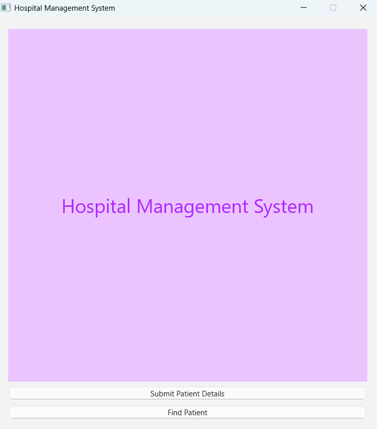
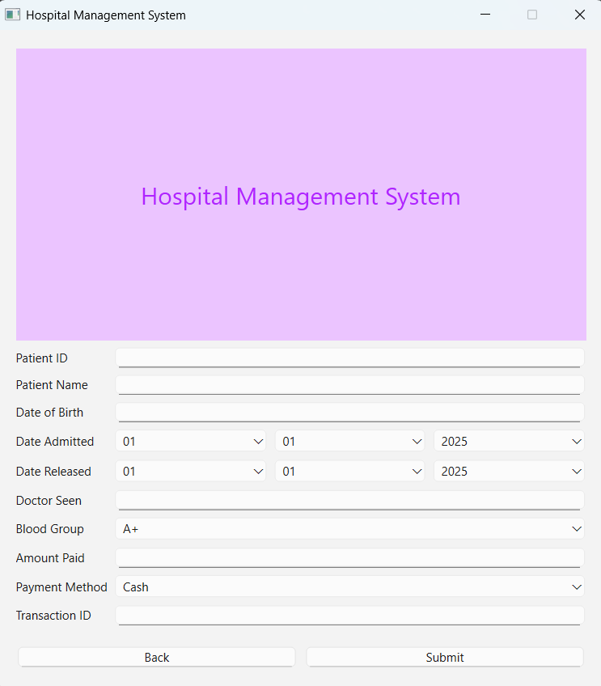
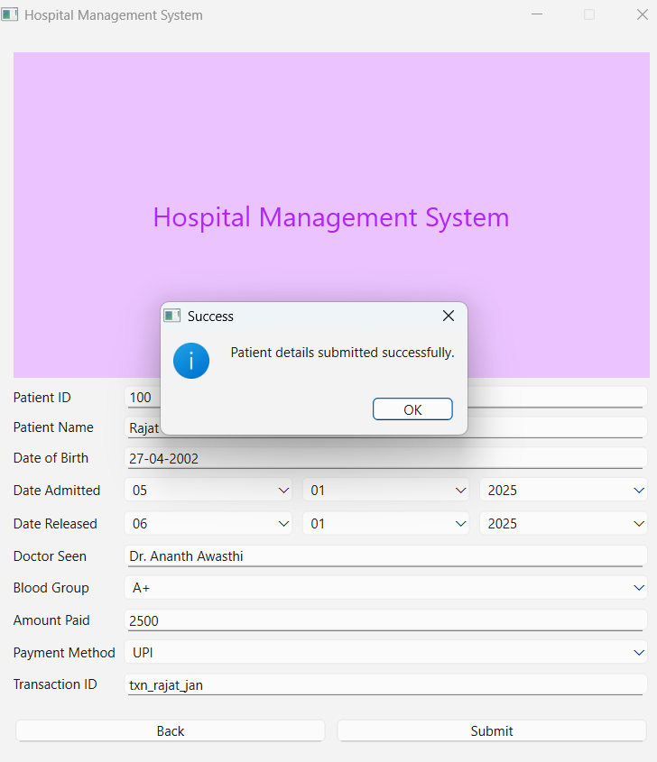
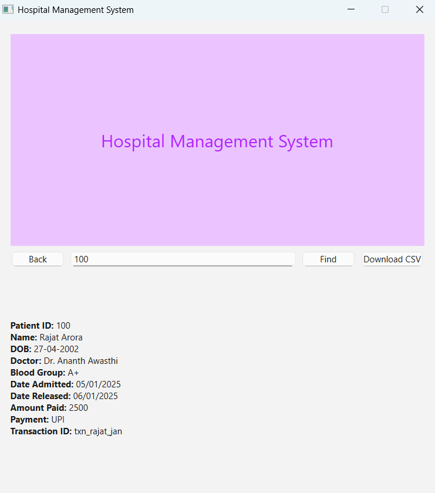
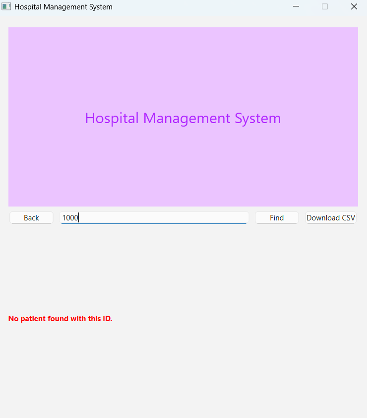
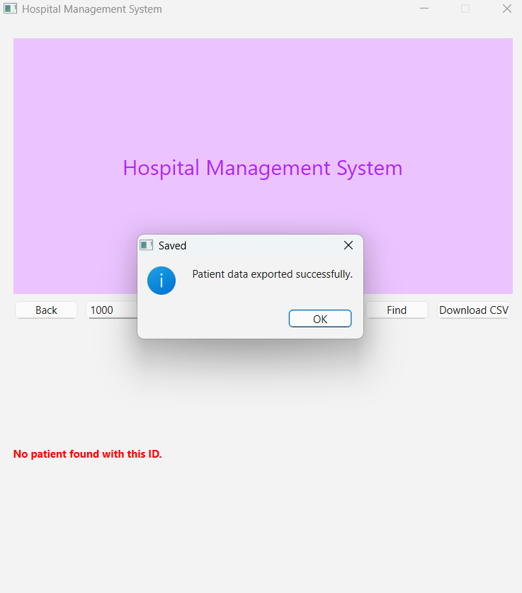

# Hospital Management System

## 📝 Description
This is a cross-platform desktop application developed using **Qt and C++** designed to help manage patient records within a small clinic or hospital setting. 
It provides a simple graphical interface for submitting new patient details, searching for existing records, and exporting all patient data.

## ✨ Features
* **Intuitive Graphical User Interface (GUI):** Built with Qt widgets for ease of use.
* **Patient Data Management:**
  * Allows submission of new patient records including like Patient ID (mandatory), Patient Name (mandatory), Date of Birth, Doctor Seen, Blood Group, Date Admitted , Amount Paid, Payment Method etc.
  * Validates that Patient ID and Name are not empty upon submission.
* **SQLite Database Integration:** All patient information is persistently stored in a local `patients.db` SQLite database file.
* **Patient Search Functionality:** Quickly retrieve and display full details of a patient by entering their unique Patient ID.
* **Data Export (CSV):** Export all stored patient data from the database into a readable CSV (Comma Separated Values) file.
* **Navigation:** Simple menu-driven navigation between patient submission and search functionalities.

## 🚀 Getting Started

### Prerequisites
To build and run this project, you will need:
* **Qt Creator IDE** (Recommended for development and building)
* **Qt Framework** (The project uses Qt 6.9.1 , but should be compatible with recent Qt6 versions)
* A **C++ Compiler** compatible with Qt (e.g., MinGW, MSVC, GCC/Clang)

### Installation & Building

1.  **Clone the repository:**
    ```bash
    git clone [https://github.com/gyandeep2902/Hospital_Management_System.git](https://github.com/gyandeep2902/Hospital_Management_System.git)
    cd Hospital_Management_System
    ```

2.  **Open in Qt Creator:**
    * Launch Qt Creator.
    * Go to `File > Open File or Project...`
    * Navigate to the cloned `Hospital_Management_System` folder and select the `CMakeLists.txt` file (or your `.pro` file if you're using qmake).
    * When prompted, configure your build kit. Choose your desired Desktop kit (e.g., `Desktop Qt 6.9.1 MinGW 64-bit`).

3.  **Build the project:**
    * Once the project is loaded, click the "Build" button (typically a hammer icon on the left sidebar) or go to `Build > Build Project "Hospital_Management_System"`.

4.  **Run the application:**
    * After a successful build, click the "Run" button (the green play icon on the left sidebar) or go to `Build > Run`.

## 📸 Screenshots



_The opening screen of the Hospital Management System._



_The form for submitting new patient information._


_Patient information successfully saved._




_Patient found message._



_Message when patient is not found._



_Exporting data to a csv file._


_ Downloaded csv file viewed in excel._

## 💡 Usage
Once the application is running:

1.  **Main Menu:** You will be presented with a simple menu.
    * Click **"Submit Patient Details"** to open the patient registration form.
    * Click **"Find Patient"** to navigate to the search interface.
2.  **Submit Patient Details Page:**
    * Fill in all the relevant patient information. Patient ID and Patient Name are required fields.
    * Use the dropdown menus for Blood Group, Date Admitted, Date Released, and Payment Method.
    * Click the **"Submit"** button to save the data to the database. You'll receive a confirmation or error message.
    * Click **"Back"** to return to the Main Menu.
3.  **Find Patient Page:**
    * Enter the **Patient ID** in the designated input field.
    * Click the **"Find"** button to retrieve the patient's information, which will be displayed below.
    * Click the **"Download CSV"** button to export all current patient records in the database to a CSV file, which you can save to your desired location.
    * Click **"Back"** to return to the Main Menu.

## 🤝 Contributing
Contributions are welcome! If you find bugs, have feature suggestions, or want to improve the codebase, please:

1.  Fork the repository.
2.  Create a new branch for your feature or bug fix: `git checkout -b feature/your-feature-name`
3.  Make your changes and commit them with descriptive messages: `git commit -m 'Add new feature'`
4.  Push your changes to your new branch: `git push origin feature/your-feature-name`
5.  Open a Pull Request to the `master` branch of this repository.

## 📄 License
This project is licensed under the [**MIT License**](LICENSE.md). You can find the full license text in the `LICENSE.md` file in this repository.

## 📧 Contact
* **Gyandeep** (GitHub: [gyandeep2902](https://github.com/gyandeep2902))
* Project Link: [https://github.com/gyandeep2902/Hospital_Management_System](https://github.com/gyandeep2902/Hospital_Management_System)

## 🙏 Acknowledgements
* Built with the powerful [Qt Framework](https://www.qt.io/).
* Utilizes [SQLite](https://www.sqlite.org/) for local data persistence.
